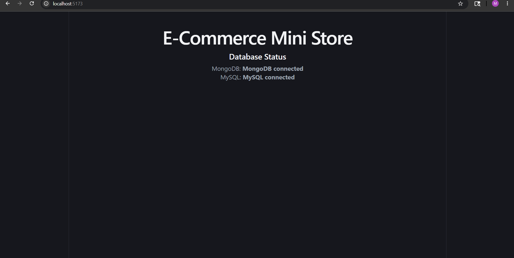

# E-Commerce Mini Store

## Project Overview

E-Commerce Mini Store is a full-stack MERN-style e-commerce application built during internship training.

The project includes:

- React frontend
- Node.js + Express backend
- MongoDB Atlas database
- MySQL integration
- REST APIs
- Dynamic product pages

---

# Tech Stack

## Frontend

- React.js
- React Router DOM
- Axios
- CSS

## Backend

- Node.js
- Express.js
- MongoDB Atlas
- Mongoose
- MySQL
- JWT
- Express Validator

---

# Folder Structure

```text
E-Commerce Mini Store/
│
├── frontend/
│
├── backend/
│
├── screenshots/
│
├── README.md
└── .gitignore
```

---

# Backend Features Completed

## Database

- MongoDB Atlas connection
- MySQL connection

## Product APIs

- GET all products
- GET single product
- CREATE product
- UPDATE product
- DELETE product

## Backend Improvements

- Validation middleware
- Error handling middleware
- Pagination
- Category filtering

---

# Frontend Features Completed

## Pages

- Home Page
- Product List Page
- Product Detail Page

## React Features

- React Router
- Dynamic routing
- Axios API calls
- Product cards
- Responsive product grid
- Navbar navigation

---

# API Endpoints

## Products

### Get All Products

```http
GET /api/products
```

### Get Product By ID

```http
GET /api/products/:id
```

### Create Product

```http
POST /api/products
```

### Update Product

```http
PUT /api/products/:id
```

### Delete Product

```http
DELETE /api/products/:id
```

---

# Frontend Routes

| Route | Description |
|---|---|
| `/` | Home Page |
| `/products` | Product List |
| `/products/:id` | Product Detail |

---

# Screenshots



# Current Progress

## Completed Till 28 May

- Backend CRUD APIs
- MongoDB integration
- MySQL integration
- Product schema
- Seeded products
- Validation middleware
- Error handling
- Pagination
- React frontend setup
- Product listing page
- Product detail page
- React Router integration
- Dynamic product fetching

---

# Upcoming Features

- Cart functionality
- Authentication
- JWT protected routes
- Search functionality
- Category filters
- Admin dashboard
- Order management

---

# Author

Meet Thacker