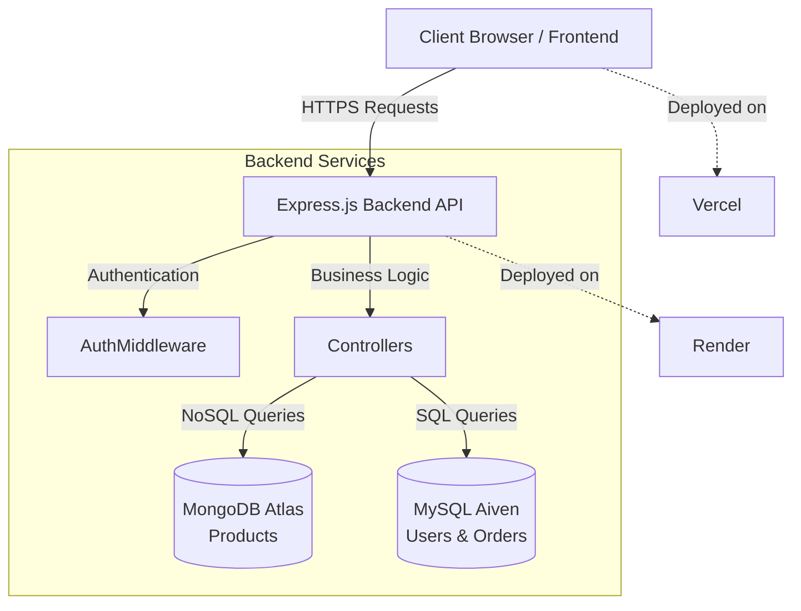

# 🛒 Cartify

> **A Full-Stack E-Commerce Mini Store**

A comprehensive, responsive, and feature-rich E-Commerce platform built with the MERN stack (using both MongoDB and MySQL). Developed as part of a structured internship learning roadmap to master full-stack web development, database management, and secure API integrations.

---

## 📖 Project Overview

Cartify is a modern online shopping destination that allows users to browse products, manage their shopping carts, and place orders securely. It features a robust backend architecture utilizing **MongoDB** for flexible product data storage and **MySQL** for structured relational data like users and orders. The platform includes full user authentication, role-based access control, and an administrative dashboard for product and order management.

---

## ✨ Features

- **User Signup/Login**: Secure authentication using JWT and bcrypt password hashing.
- **Product Listing**: Browse all available products with responsive grid layouts.
- **Product Details**: Detailed view of individual products including images, price, stock, and description.
- **Search & Filter**: Find products quickly via search functionality and category filtering.
- **Cart Management**: Add/remove items, adjust quantities, and persist cart data using local storage.
- **Orders**: Secure checkout process with atomic stock validation and order history tracking.
- **Admin Product Management**: Dedicated admin dashboard to create, update, and delete products.
- **Image Upload**: Upload product images directly from the admin panel.

---

## 🛠️ Tech Stack

### Frontend
- **Framework**: React (Vite)
- **Routing**: React Router DOM
- **Styling**: Vanilla CSS
- **State Management**: Context API
- **HTTP Client**: Axios

### Backend
- **Runtime**: Node.js
- **Framework**: Express.js
- **Authentication**: JWT & bcrypt

### Databases
- **NoSQL**: MongoDB Atlas (Products Collection)
- **SQL**: MySQL / Aiven Cloud (Users, Orders, Order Items Tables)

### Deployment
- **Frontend**: Vercel
- **Backend**: Render

---

## 🏗️ Project Architecture Diagram



*(ASCII Alternative)*
```text
+-------------------+        HTTP/REST        +------------------------+
|                   |  ---------------------> |                        |
|  React Frontend   |                         |  Express.js Backend    |
|  (Hosted on       |  <--------------------- |  (Hosted on Render)    |
|   Vercel)         |       JSON Responses    |                        |
+-------------------+                         +------------------------+
                                                /                  \
                                              /                      \
                                            /                          \
                               +-------------------+          +-------------------+
                               |                   |          |                   |
                               |   MongoDB Atlas   |          |    MySQL (Aiven)  |
                               |   (Products DB)   |          | (Users & Orders)  |
                               +-------------------+          +-------------------+
```

---

## 📂 Folder Structure

```text
Cartify/
├── backend/
│   ├── src/
│   │   ├── config/          # Database connection setups
│   │   ├── controllers/     # Route logic and handlers
│   │   ├── middleware/      # Auth, Admin, Error, and Validation middlewares
│   │   ├── models/          # Mongoose schemas
│   │   ├── routes/          # Express route definitions
│   │   ├── validators/      # Input validation logic
│   │   └── server.js        # Main entry point for the backend
│   ├── .env.example
│   └── package.json
│
├── frontend/
│   ├── public/              # Static assets
│   ├── src/
│   │   ├── components/      # Reusable UI components
│   │   ├── context/         # Auth and Cart contexts
│   │   ├── hooks/           # Custom React hooks
│   │   ├── pages/           # Application views/pages
│   │   ├── services/        # API integration (Axios)
│   │   ├── styles/          # Vanilla CSS stylesheets
│   │   ├── App.jsx          # Main application component
│   │   └── main.jsx         # React DOM rendering
│   ├── .env.example
│   └── package.json
│
└── README.md
```

---

## 🚀 Installation & Local Setup

### Prerequisites
- Node.js (v16+ recommended)
- MongoDB account (Atlas or Local)
- MySQL database (Local or Aiven Cloud)

### 1. Backend Setup

```bash
# Navigate to the backend directory
cd backend

# Install dependencies
npm install

# Create environment variables file (see Environment Variables section)
cp .env.example .env

# Start the development server
npm run dev
```

### 2. Frontend Setup

```bash
# Navigate to the frontend directory
cd frontend

# Install dependencies
npm install

# Create environment variables file
cp .env.example .env

# Start the development server
npm run dev
```

---


## 🧩 Challenges Faced During Development

- **Dual Database Architecture**: Integrating MongoDB for flexible product schemas and MySQL for strict relational schemas (users/orders) required careful management of IDs and references.
- **Atomic Transactions**: Ensuring product stock decrements in MongoDB occurred reliably when an order was placed in MySQL, and implementing rollbacks if the MySQL insertion failed.
- **Role-Based Routing**: Designing a secure routing flow in React where unauthorized users are blocked from admin routes, preventing UI flickering on refresh.
- **State Management**: Syncing cart state across different components and persisting it reliably using Context API and `localStorage`.

---

## 📚 Learning Outcomes

- Proficiently structured a full-stack MERN/MySQL application from scratch.
- Mastered dual-database architecture using Mongoose and raw MySQL queries/ORM.
- Implemented robust authentication flows with JWT and bcrypt.
- Improved frontend skills focusing on React Context, custom hooks, and vanilla CSS for responsive UI design.
- Learned deployment strategies for both frontend (Vercel) and backend (Render) platforms.

---

## 🔮 Future Improvements

- Add integration for a real Payment Gateway (e.g., Stripe or Razorpay).
- Implement a review and rating system for products.
- Send automated email confirmations for orders and signups using Nodemailer.
- Add real-time order tracking functionality.
- Enhance the admin dashboard with sales charts and analytics.

